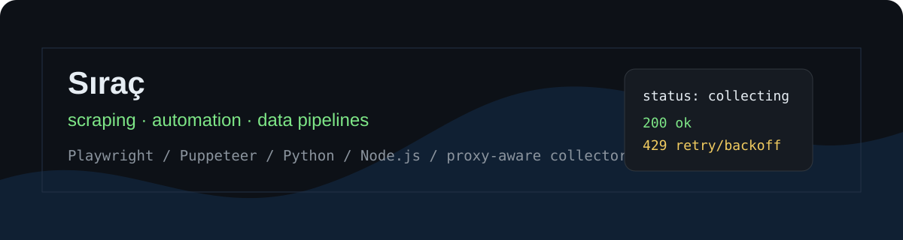

### Sıraç

I build scraping, automation and data collection systems.

Most of my work is around websites that do not behave like clean APIs: authenticated portals, changing tables, mobile/web request differences, session handling, rate limits and data that has to stay fresh.

  
  
  
  

I run two products of my own:

- [OranAnalizcim](https://orananalizcim.com/tr/) - football odds and historical odds analysis
- [dizifilmyorum](https://dizifilmyorum.com) - TV and film tracking/review platform

## Work

- authenticated scraping and browser automation
- direct API extraction when browser automation is too slow or expensive
- reversing request signatures, device fingerprints and TLS/JA3 checks to reach protected endpoints
- proxy-aware request flows, cookies, sessions, retries and pacing
- odds/data normalization, snapshotting and change tracking
- Linux deploys and production workers

## Public demos

- [signed-endpoint-scraper](https://github.com/sirac-dev/signed-endpoint-scraper) - breaks a signed + fingerprint-gated endpoint: reads the seed off the page, rebuilds the signature, refreshes and backs off on a 403
- [tls-fingerprint-scraper](https://github.com/sirac-dev/tls-fingerprint-scraper) - getting past TLS/JA3 anti-bot fingerprinting with curl_cffi
- [portal-data-extractor](https://github.com/sirac-dev/portal-data-extractor) - authenticated portal scraping with session reuse, paging, retries and CSV/JSON export
- [scraper-reliability-kit](https://github.com/sirac-dev/scraper-reliability-kit) - retry, cooldown, health scoring and 403/429 handling against a fake local target
- [odds-data-pipeline-demo](https://github.com/sirac-dev/odds-data-pipeline-demo) - mock odds feed normalization, snapshots and change tracking

Most of my real scraping work cannot be public because it contains private endpoints, customer logic, session details or source-specific request handling. These repos are cleaned demos that show the workflow without exposing targets.
